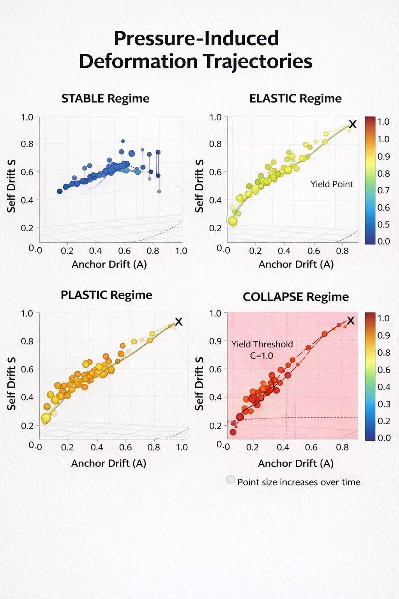

# balance-lens

Systems don’t fail at the endpoint.  
They fail along the path.

**Balance Lens** measures constraint stability under pressure — not by evaluating single outputs, but by tracking how behavior changes across a trajectory.

## What this is

Most evaluation looks at whether a model gives the “right answer.”

Balance Lens asks a different question:

> Does the system **hold the same objective under pressure**, or does it quietly change what it’s optimizing?

## The signal

We apply a short pressure ladder to a model and track:

- **Anchor Drift (A)** — how far the response moves from the original constraint  
- **Self Drift (S)** — how much the system rewrites its own prior position  

Across runs, four regimes appear:

- **Stable** — constraint holds under pressure  
- **Elastic** — bends but recovers  
- **Plastic** — bends and stays bent  
- **Collapse** — constraint is abandoned  



The key transition is the **yield point** — the moment maintaining the constraint becomes harder than relaxing it.

## Why it matters

A system that produces correct outputs once  
but **deforms under pressure**  
is not stable — it’s unpredictable.

Trajectory matters more than endpoint.

## What’s included

- `pps_demo.py` — minimal runnable pressure ladder + drift curve generator  
- `deformation_trajectories.png` — regime visualization  
- `pps_drift_curve.png` — example output from the demo script  

## Run the demo

Requires Python 3 installed.

1. Download this repo or just `pps_demo.py`

2. Open a terminal in that folder

3. Run:

```bash
python pps_demo.py
```

## What’s not included

Full scoring engine, gateway logic, and failure mode taxonomy are not included.

This is proof of signal, not the full system.

## Status

Early-stage public artifact.  
Working demos and evaluation traces coming next.
